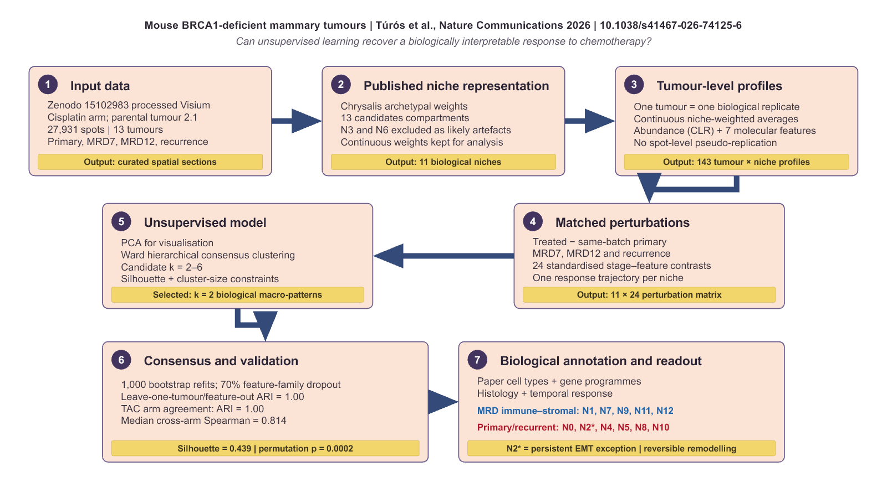
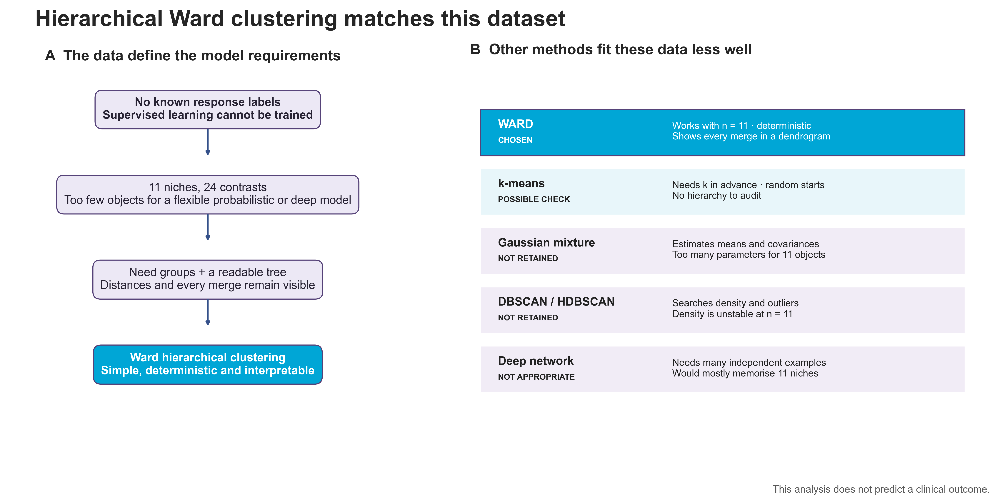
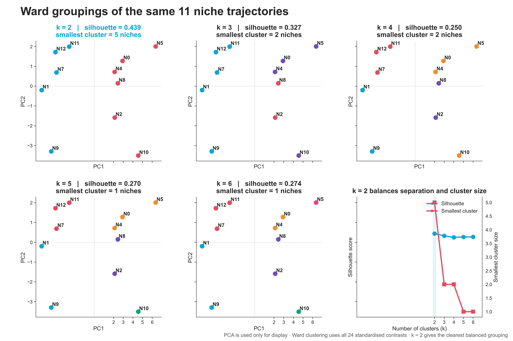
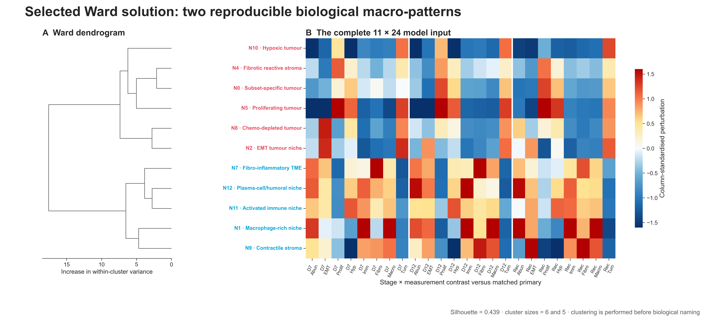
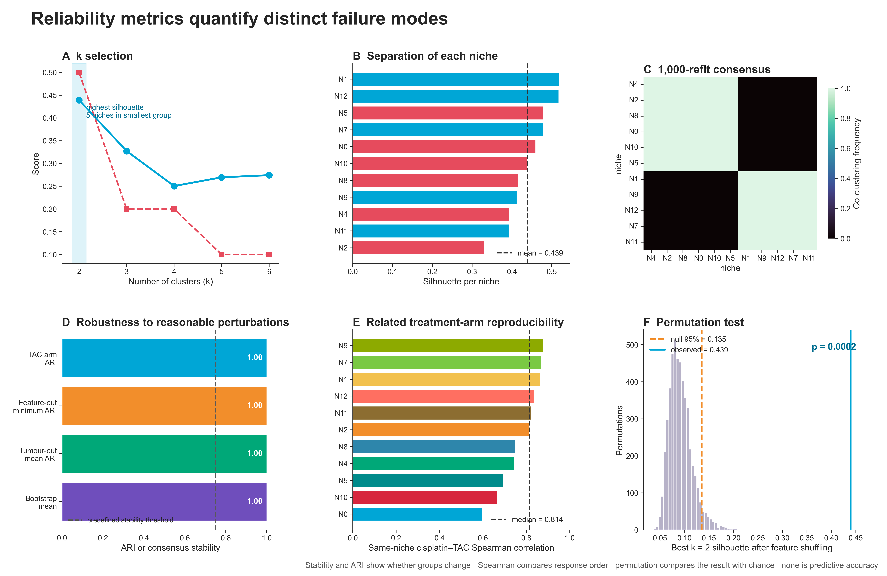

# Spatial Breast Cancer Niche Clustering

This project is a small re-analysis of the spatial transcriptomics data from
Túrós *et al.* It was developed to learn how an unsupervised machine-learning
result is built, tested and connected to biological evidence.

The analysis asks whether niches with similar abundance and molecular changes
after chemotherapy form reproducible response groups. It confirms the broad
remodelling described by the paper; it does not claim a new mechanism.

- Paper: [Nature Communications (2026)](https://doi.org/10.1038/s41467-026-74125-6)
- Data: [Zenodo 15102983](https://doi.org/10.5281/zenodo.15102983)

## Data

The mouse Visium files contain spatial coordinates, H&E images, continuous
Chrysalis weights, cell2location estimates and pathway scores. The cisplatin
analysis contains 27,931 spots from 13 tumours. N3 and N6 are removed as likely
technical compartments, following the paper, leaving 11 biological niches.

## Workflow



*Figure 1. From deposited Visium sections to biologically interpreted response
patterns.*

Figure 1 follows the complete analysis from tissue measurements to response
groups, stability checks and biological annotation. One tumour × niche profile
is one biological observation. Treated tumours are compared with primary
tumours from the same parental tumour and batch. The final matrix contains 11
niches and 24 standardised stage–feature contrasts.

## From tissue spots to model input


*Figure 2. Spatial distribution of the two response macro-patterns across the
four treatment stages.*

As shown in Figure 2, red marks the primary/recurrent-associated response group
and blue marks the MRD-associated immune–stromal group. The four large panels
show one complete stage series selected by a fixed rule; they are not
longitudinal sections from one tumour. This spot-level view gives spatial
context to the tumour-level profiles used by the model.

A Visium spot is a small measured tissue area containing several cells. The
coloured circle is therefore not a single cell and not a definitive niche
label. Chrysalis gives each spot continuous weights: one spot can partly belong
to several niches. For each tumour and niche, the workflow computes a weighted
mean of abundance and seven molecular measurements. Abundance is
CLR-transformed because niche proportions are compositional.

MRD7, MRD12 and recurrent tumours are then compared with same-batch primary
tumours. This avoids treating thousands of spots from one section as thousands
of independent biological replicates. The result is one trajectory per niche:
eight measurements at three stages, or 24 contrasts. The 24 columns are
standardised before clustering so one measurement cannot dominate only because
its numerical scale is larger.

This remains a bioinformatics project rather than a mathematics exercise. The
formulas below are included because they make each data transformation explicit
and help explain exactly what enters the model.

For tumour $t$, niche $n$ and molecular feature $f$, the weighted tumour-level
profile is

$$
x_{tnf}=\frac{\sum_{s=1}^{S_t} w_{sn}x_{sf}}
{\sum_{s=1}^{S_t} w_{sn}},
$$

where $s$ denotes a Visium spot, $w_{sn}$ is its continuous Chrysalis weight for
niche $n$, and $x_{sf}$ is its feature value. The corresponding relative niche
abundance is

$$
p_{tn}=\frac{\sum_s w_{sn}}{\sum_m\sum_s w_{sm}}.
$$

Because all niche abundances from one tumour sum to one, they are transformed
with the centred log-ratio (CLR):

$$
\mathrm{CLR}(p_{tn})=\log\left(
\frac{p_{tn}+\varepsilon}
{\left[\prod_{m=1}^{N}(p_{tm}+\varepsilon)\right]^{1/N}}
\right).
$$

Here, $\varepsilon$ is a small pseudocount used when an abundance is zero. Each
feature is first expressed relative to its variation among primary tumours:

$$
x^{\ast}_{tnf}=\frac{x_{tnf}}{\sigma_{f,\mathrm{primary}}}.
$$

A treated tumour is then compared with the mean primary value from the same
batch. For treatment stage $r$, this gives

$$
\Delta_{nfr}=\frac{1}{|T_r|}\sum_{t\in T_r}
\left(x^{\ast}_{tnf}-\overline{x}^{\ast}_{nf,\mathrm{primary},b(t)}\right),
$$

where $T_r$ is the set of treated tumours at stage $r$ and $b(t)$ is the batch
of tumour $t$. Finally, each of the 24 contrast columns is standardised across
niches:

$$
z_{nj}=\frac{\Delta_{nj}-\mu_j}{\sigma_j}.
$$

The resulting matrix $Z\in\mathbb{R}^{11\times24}$ is the direct input to the
unsupervised model.

## Unsupervised model



*Figure 3. Dataset constraints and comparison of candidate unsupervised
models.*

Figure 3A summarises the small unlabelled 11 x 24 input. Figure 3B compares the
main candidate methods and explains the choice of Ward clustering.

There are no known response-group labels, so this is unsupervised learning. Ward
hierarchical clustering is suited to the very small input of 11 objects: it is
deterministic, needs no train/test classifier split and leaves a tree in which
every merge can be checked. At each step it joins the pair producing the smallest increase
in within-cluster variance. PCA is used only to display the 24-dimensional
result; clustering itself uses all 24 standardised contrasts.

K-means is a reasonable sensitivity check but has random starting centres and
no hierarchy. A Gaussian mixture estimates too many covariance parameters for
11 objects. Density clustering is unreliable with so few points, and a neural
network would mainly memorise them.

The model receives only the matrix $Z$ and produces one group index for each
niche:

$$
Z\in\mathbb{R}^{11\times24}
\quad\longrightarrow\quad
c=(c_1,\ldots,c_{11}),\qquad c_i\in\{1,\ldots,k\}.
$$

There is no known target value $y$ to predict. Ward clustering starts with one
niche per group and repeatedly merges the pair $A,B$ that minimises

$$
\Delta(A,B)=\frac{|A||B|}{|A|+|B|}
\left\|\boldsymbol{\mu}_A-\boldsymbol{\mu}_B\right\|_2^2,
$$

where $|A|$ and $|B|$ are group sizes and $\boldsymbol{\mu}_A$ and
$\boldsymbol{\mu}_B$ are their mean 24-dimensional profiles. This quantity is
the increase in total within-group squared variation caused by the merge.

PCA does not change these assignments. It finds directions
$\mathbf{v}_\ell$ satisfying

$$
\frac{Z^\mathsf{T}Z}{n-1}\mathbf{v}_\ell
=\lambda_\ell\mathbf{v}_\ell,
\qquad
\mathbf{t}_\ell=Z\mathbf{v}_\ell,
$$

then uses the first two score vectors $\mathbf{t}_1$ and $\mathbf{t}_2$ as the
two axes of the PCA plots.

## Selecting the number of patterns



*Figure 4. Ward solutions obtained by cutting the same hierarchical tree from
`k = 2` to `k = 6`.*

Figure 4 compares the same Ward tree at `k = 2–6`; the PCA panels show the
groups in two dimensions, while clustering uses all 24 contrasts. PCA
(principal component analysis) is only a simpler view of the main variation.
The decision combines separation and minimum cluster size. `k = 2` has the largest silhouette
(`0.439`) and balanced groups of six and five niches. Larger values reduce the
silhouette and create groups of only one or two niches, which are not credible
macro-patterns here.

For niche $i$, $a(i)$ is its mean distance from the other niches in its own
group. The value $b(i)$ is the smallest mean distance to any other group:

$$
a(i)=\frac{1}{|C_i|-1}
\sum_{\substack{j\in C_i\\j\ne i}}d(i,j),
\qquad
b(i)=\min_{C\ne C_i}\frac{1}{|C|}\sum_{j\in C}d(i,j).
$$

Its silhouette is therefore

$$
s(i)=\frac{b(i)-a(i)}{\max\{a(i),b(i)\}},
\qquad
S=\frac{1}{n}\sum_{i=1}^{n}s(i).
$$

The reported value `0.439` is the mean $S$ over all 11 niches. The formula
rewards small distances within a group and large distances between groups.



*Figure 5. Selected two-group dendrogram and complete standardised input
matrix.*

Figure 5A shows the complete Ward dendrogram and its two main branches. Figure
5B shows the full 11 × 24 matrix used by the model; the vivid blue-to-red
gradient represents relative decreases and increases after standardisation.
Biological names are added only after these numeric groups are fixed.

## Biological annotation

Biological names are assigned after clustering. They come from the paper's
cell-type associations, niche gene programmes, histology and treatment response.
The original `N` identifiers remain visible for provenance.

| ID | Biological name | Class | Main programme or context |
|---|---|---|---|
| N0 | Subset-specific tumour | tumour | rare, incompletely assigned tumour compartment |
| N1 | Macrophage-rich niche | immune TME | macrophage/monocyte and TREM2–APOE programmes |
| N2 | EMT tumour niche | tumour | EMT, motility, adhesion and drug-tolerant plasticity |
| N4 | Fibrotic reactive stroma | stromal TME | collagen and extracellular-matrix organisation |
| N5 | Proliferating tumour | tumour | cell cycle, DNA replication and E2F/MYC |
| N7 | Fibro-inflammatory TME | stromal/immune TME | connective tissue and immune infiltration |
| N8 | Chemo-depleted tumour | tumour | selectively lost after chemotherapy |
| N9 | Contractile stroma | stromal TME | smooth-muscle and structural programmes |
| N10 | Hypoxic tumour | tumour | hypoxia and metabolic stress near necrosis |
| N11 | Activated immune niche | immune TME | macrophage, defence and complement programmes |
| N12 | Plasma-cell/humoral niche | immune TME | plasma cells and B-cell/humoral activity |

The complete annotation table is written to
[`results/tables/niche_annotations.csv`](results/tables/niche_annotations.csv).

## Model checks



*Figure 6. Complementary checks of the selected two-group solution.*

Figure 6A-C examines model choice, silhouette separation (how well each niche
fits its group) and pairwise consensus (how often two niches remain together
across repeated runs). Figure 6D tests robustness to tumour and feature
removal, Figure 6E compares the cisplatin and TAC arms, and Figure 6F compares
the observed result with shuffled data. They test different failure modes
rather than predictive accuracy.

| Check | Result |
|---|---:|
| Selected patterns | 2 |
| Silhouette (separation between groups) | 0.439 |
| PCA variance in two dimensions (variation retained in the plot) | 80.2% |
| Mean bootstrap stability (average repeatability across refits) | 1.00 |
| Leave-one-tumour-out ARI (agreement after removing one tumour) | 1.00 |
| Minimum feature-removal ARI (agreement after removing one measurement family) | 1.00 |
| TAC-arm agreement ARI (agreement between treatment arms) | 1.00 |
| Median cross-arm Spearman correlation (rank agreement) | 0.814 |
| Cluster permutation test (comparison with shuffled data) | 0.0002 |

These checks support the stability of a coarse two-pattern solution. They are
not test-set accuracy, and TAC is a related treatment arm from the same study.

- **Silhouette** compares each niche's mean distance to its own group with its
  distance to the other group. Values near 1 indicate clear separation, near 0
  indicate a boundary, and negative values suggest possible misassignment.
- **Consensus** is the fraction of 1,000 refits (new runs after resampling the
  data) in which each pair of niches is placed together. It measures how often
  the same groups return.
- **Adjusted Rand index (ARI)** compares two complete groupings while
  correcting agreement expected by chance. `1` means identical groups;
  values near `0` mean chance-level agreement.
- **Leave-one-tumour-out and feature-out ARI** recompute the full analysis after
  removing one tumour or one feature family. They test dependence on a single
  sample or measurement.
- **Spearman correlation** compares the rank order of cisplatin and TAC response
  trajectories for the same niche. It tests cross-arm agreement, not causality.
- **Permutation p-value** shuffles features within columns 5,000 times and asks
  how often random data reach the observed best silhouette. Here
  `p = (0 + 1) / (5000 + 1) = 0.0002`.

For $B=1000$ bootstrap refits, pairwise consensus is calculated as

$$
C_{ij}=\frac{1}{B}\sum_{b=1}^{B}
\mathbf{1}\left[c_i^{(b)}=c_j^{(b)}\right].
$$

$C_{ij}=1$ means niches $i$ and $j$ remain together in every refit. The
stability of niche $i$ is the mean consensus with the other niches assigned to
its final group $G_i$:

$$
\mathrm{Stability}_i=
\frac{1}{|G_i|-1}
\sum_{\substack{j\in G_i\\j\ne i}}C_{ij}.
$$

The adjusted Rand index uses the contingency table between two complete
clusterings. If $n_{uv}$ is the number of niches shared by group $u$ in the
first clustering and group $v$ in the second, with row sums $a_u$ and column
sums $b_v$, then

$$
\begin{aligned}
I &= \sum_{uv}\binom{n_{uv}}{2}, &
A &= \sum_u\binom{a_u}{2},\\
B &= \sum_v\binom{b_v}{2}, &
E &= \frac{AB}{\binom{n}{2}}.
\end{aligned}
$$

With $I$ as the observed pair agreement and $E$ as the agreement expected by
chance,

$$
\mathrm{ARI}=\frac{I-E}{\tfrac{1}{2}(A+B)-E}.
$$

This chance correction is why ARI is more informative than simply counting the
fraction of unchanged niche labels.

For two response rankings without ties, Spearman correlation can be written as

$$
\rho_s=1-\frac{6\sum_{i=1}^{n}d_i^2}{n(n^2-1)},
$$

where $d_i$ is the difference between the two ranks for niche $i$. The generic
permutation p-value uses the same finite-sample correction as the value reported
above:

$$
p=\frac{1+\sum_{b=1}^{B}
\mathbf{1}\left[S_b^{\mathrm{perm}}\ge S_\mathrm{obs}\right]}{B+1}.
$$

## Result

| Macro-pattern | Niches | Interpretation |
|---|---|---|
| MRD-associated immune–stromal remodelling | N1, N7, N9, N11, N12 | immune, macrophage, humoral and stromal programmes become prominent during residual disease |
| Primary/recurrent tissue architecture | N0, N2, N4, N5, N8, N10 | mainly tumour and peritumour programmes diminish or remodel during MRD and return at recurrence |

N2 is a required biological caveat. The original study describes the EMT niche
as persistent and chemotherapy-tolerant. Its placement in the second ML group
reflects similarity of the complete multivariate trajectory, not proof that its
abundance strongly contracts.

## Project layout

```text
niche_perturbation_patterns/
├── README.md
├── PIPELINE.md
├── FIGURES.md
├── RESULTS.md
├── run_analysis.py
├── app.py
├── config.yaml
├── src/
│   ├── annotations.py
│   ├── core.py
│   ├── explain_figures.py
│   ├── figures.py
│   ├── readme_figures.py
│   └── visium.py
├── tests/
├── data/
│   ├── raw/
│   └── processed/
├── assets/readme/
└── results/
    ├── figures/
    └── tables/
```

## Run

```powershell
cd C:\Users\pcyou\Desktop\bioinfo_llm\niche_perturbation_patterns
python -m pip install -r requirements.txt
python run_analysis.py --h5ad-dir data\raw\extracted\visium_mouse\processed\mouse_main --treatment cisplatin_6mg/kg
python -m streamlit run app.py
```

The app opens at `http://localhost:8507`.

## Limits

- No clinical classifier is trained.
- Biological annotation is interpretive and does not alter the clustering.
- Cell-type summaries used as ML features cannot serve as independent validation.
- Histology and paper-derived gene programmes provide the less circular evidence.
- The second treatment arm is internal rather than external validation.

## References and documentation

The workflow uses the processed mouse Visium objects released with the study.
It does not rerun Chrysalis or cell2location: their compartment scores,
cell-type estimates and biological annotations were produced upstream by the
authors and are treated here as input data. The perturbation profiles, Ward
clustering and reliability analyses are implemented independently in this
repository.

### Study and data

- Túrós *et al.* (2026), [Spatiotemporal organisation of residual disease in
  mouse and human BRCA1-deficient mammary tumours and breast
  cancer](https://doi.org/10.1038/s41467-026-74125-6), *Nature
  Communications*. This is the source paper for the biological question,
  experimental design and niche annotations.
- [Processed spatial transcriptomics data](https://doi.org/10.5281/zenodo.15102983),
  Zenodo record 15102983. The mouse Visium `.h5ad` files analysed in this
  repository come from this deposit.
- [GEO accession GSE299631](https://www.ncbi.nlm.nih.gov/geo/query/acc.cgi?acc=GSE299631),
  the raw sequencing record reported by the study.
- [Authors' residual-disease code repository](https://github.com/rottenberglab/residual-disease),
  cited in the paper's Code availability section and released for the original
  published analyses.
- Túrós *et al.* (2024), [Chrysalis: decoding tissue compartments in spatial
  transcriptomics with archetypal
  analysis](https://doi.org/10.1038/s42003-024-07165-7), *Communications
  Biology*. Chrysalis generated the continuous niche scores available in the
  processed objects.
- Kleshchevnikov *et al.* (2022), [Cell2location maps fine-grained cell types
  in spatial transcriptomics](https://doi.org/10.1038/s41587-021-01139-4),
  *Nature Biotechnology*. Cell2location generated the cell-type estimates used
  by the original study to help interpret the niches.

### Statistical methods

- Ward (1963), [Hierarchical Grouping to Optimize an Objective
  Function](https://doi.org/10.1080/01621459.1963.10500845), introduced Ward's
  minimum-variance hierarchical clustering criterion.
- Aitchison (1982), [The Statistical Analysis of Compositional
  Data](https://doi.org/10.1111/j.2517-6161.1982.tb01195.x), provides the
  framework for analysing proportions through log-ratios rather than raw
  Euclidean differences.
- Rousseeuw (1987), [Silhouettes: A graphical aid to the interpretation and
  validation of cluster analysis](https://doi.org/10.1016/0377-0427(87)90125-7),
  defines the silhouette used to compare values of $k$.
- Hubert and Arabie (1985), [Comparing
  partitions](https://doi.org/10.1007/BF01908075), defines the adjusted Rand
  index used to compare cluster assignments after refitting.
- Monti *et al.* (2003), [Consensus Clustering: A Resampling-Based Method for
  Class Discovery and Visualization of Gene Expression Microarray
  Data](https://doi.org/10.1023/A:1023949509487), provides the resampling logic
  behind the consensus matrix.
- Efron (1979), [Bootstrap Methods: Another Look at the
  Jackknife](https://doi.org/10.1214/aos/1176344552), is the basis for the
  tumour-level bootstrap confidence intervals and stability checks.
- Spearman (1904), [The Proof and Measurement of Association between Two
  Things](https://doi.org/10.2307/1412159), introduced the rank correlation
  used to compare niche response orders between treatment arms.
- Phipson and Smyth (2010), [Permutation P-values Should Never Be
  Zero](https://doi.org/10.2202/1544-6115.1585), supports the finite-sample
  correction $(b+1)/(B+1)$ used for the permutation p-values.
- McInnes *et al.* (2018), [UMAP: Uniform Manifold Approximation and
  Projection](https://doi.org/10.21105/joss.00861), describes the nonlinear
  two-dimensional projection used only for visual inspection.

### Software documentation

- Data objects and input: [AnnData](https://anndata.readthedocs.io/en/stable/)
  and [Scanpy `read_h5ad`](https://scanpy.readthedocs.io/en/stable/generated/scanpy.read_h5ad.html).
- Tables and numerical operations: [pandas](https://pandas.pydata.org/docs/)
  and [NumPy](https://numpy.org/doc/stable/).
- Hierarchical clustering: [SciPy `linkage`](https://docs.scipy.org/doc/scipy/reference/generated/scipy.cluster.hierarchy.linkage.html).
- Scaling and dimension reduction: scikit-learn
  [`StandardScaler`](https://scikit-learn.org/stable/modules/generated/sklearn.preprocessing.StandardScaler.html),
  [`RobustScaler`](https://scikit-learn.org/stable/modules/generated/sklearn.preprocessing.RobustScaler.html)
  and [PCA](https://scikit-learn.org/stable/modules/generated/sklearn.decomposition.PCA.html).
- Reliability metrics: scikit-learn
  [`silhouette_score`](https://scikit-learn.org/stable/modules/generated/sklearn.metrics.silhouette_score.html)
  and [`adjusted_rand_score`](https://scikit-learn.org/stable/modules/generated/sklearn.metrics.adjusted_rand_score.html),
  with pandas [`Series.corr`](https://pandas.pydata.org/docs/reference/api/pandas.Series.corr.html)
  for Spearman correlation.
- Two-dimensional visualisation: [UMAP documentation](https://umap-learn.readthedocs.io/en/latest/)
  and [UMAP parameter guide](https://umap-learn.readthedocs.io/en/latest/parameters.html).
- Figures and interface: [Matplotlib](https://matplotlib.org/stable/),
  [seaborn](https://seaborn.pydata.org/) and
  [Streamlit](https://docs.streamlit.io/).
- Configuration files: [PyYAML documentation](https://pyyaml.org/wiki/PyYAMLDocumentation).

### Reproducible software environment

The analyses, figures and application were generated and checked with Python
3.14.0 and the following direct dependencies:

```text
anndata 0.12.9          matplotlib 3.10.7    numpy 2.3.5
pandas 2.3.3            Pillow 12.0.0         PyYAML 6.0.3
Scanpy 1.12             scikit-learn 1.7.2   SciPy 1.16.3
seaborn 0.13.2          Streamlit 1.61.1     umap-learn 0.5.11
```

These exact runtime versions are pinned in [`requirements.txt`](requirements.txt).
The test environment adds pytest 9.1.1 through
[`requirements-dev.txt`](requirements-dev.txt). This records the environment
used for the reported results instead of silently allowing later package
versions to change the analysis.
